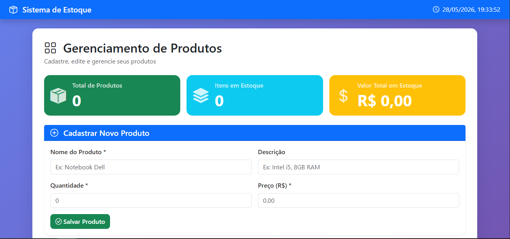

# 📦 Sistema de Estoque Full Stack

Sistema full stack para gerenciamento de produtos desenvolvido com Node.js, Express, MySQL e JavaScript.

---

## 🚀 Tecnologias utilizadas

### Front-end

* HTML5
* CSS3
* JavaScript
* Bootstrap
* Bootstrap Icons

### Back-end

* Node.js
* Express.js
* dotenv
* CORS

### Banco de dados

* MySQL
* phpMyAdmin

---

## ✨ Funcionalidades

✅ Cadastro de produtos
✅ Listagem de produtos
✅ Edição de produtos
✅ Exclusão de produtos
✅ Busca em tempo real
✅ Dashboard com estatísticas
✅ API REST
✅ Integração com MySQL
✅ Sistema responsivo
✅ Toasts de notificação
✅ Integração Front-end + Back-end

---

## 📁 Estrutura do projeto

```plaintext
sistema-estoque/
│
├── backend/
│   ├── index.js
│   ├── routes.js
│   ├── database.js
│   ├── .env.example
│   └── package.json
│
├── frontend/
│   ├── index.html
│   ├── css/
│   ├── js/
│   └── img/
│
├── database.sql
├── .gitignore
└── README.md
```

---

## 📸 Preview



---

## ⚙️ Como rodar o projeto

### 1. Clone o repositório

```bash
git clone https://github.com/JhonatanResende/sistema-de-estoque.git
```

---

### 2. Entre na pasta backend

```bash
cd backend
```

---

### 3. Instale as dependências

```bash
npm install
```

---

### 4. Configure o arquivo `.env`

Crie um arquivo chamado `.env` dentro da pasta `backend`.

Utilize as mesmas configurações do seu MySQL local.

Exemplo:

```env
DB_HOST=localhost
DB_USER=seu_usuario
DB_PASSWORD=sua_senha
DB_NAME=sistema_estoque
PORT=3001
```

---

### 5. Configure o banco de dados

O arquivo `database.sql` contém:

* criação do banco
* criação da tabela
* dados de exemplo

Importe o arquivo no MySQL ou phpMyAdmin.

---

### 6. Rode o servidor

```bash
node index.js
```

Servidor rodando em:

```text
http://localhost:3001
```

---

### 7. Abra o front-end

Abra o arquivo:

```text
frontend/index.html
```

Ou utilize a extensão Live Server do VS Code.

---

## 📡 Rotas da API

| Método | Rota              | Descrição         |
| ------ | ----------------- | ----------------- |
| GET    | /api/produtos     | Listar produtos   |
| GET    | /api/produtos/:id | Buscar produto    |
| POST   | /api/produtos     | Criar produto     |
| PUT    | /api/produtos/:id | Atualizar produto |
| DELETE | /api/produtos/:id | Deletar produto   |

---

## 🔒 Variáveis de ambiente

Este projeto utiliza variáveis de ambiente com `.env`.

O arquivo `.env` não deve ser enviado para o GitHub.

---

## 🛠️ Dependências principais

* express
* mysql2
* cors
* body-parser
* dotenv

---

## 👨‍💻 Autor

Desenvolvido por Jhonatan Resende 🚀