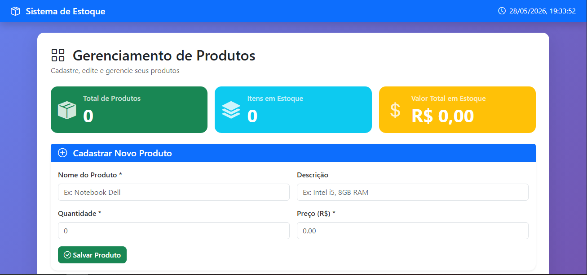

# 📦 Sistema de Estoque Full Stack

Sistema full stack para gerenciamento de produtos desenvolvido com Node.js, Express, PostgreSQL e JavaScript.

---

## 🚀 Tecnologias utilizadas

### Front-end
- HTML5
- CSS3
- JavaScript
- Bootstrap
- Bootstrap Icons

### Back-end
- Node.js
- Express.js
- dotenv
- CORS

### Banco de dados
- PostgreSQL
- pgAdmin

---

## ✨ Funcionalidades

- ✅ Cadastro de produtos
- ✅ Listagem de produtos
- ✅ Edição de produtos
- ✅ Exclusão de produtos
- ✅ Busca em tempo real
- ✅ Dashboard com estatísticas
- ✅ API REST
- ✅ Integração com PostgreSQL
- ✅ Sistema responsivo
- ✅ Toasts de notificação
- ✅ Integração Front-end + Back-end

---

## 📸 Preview



---

## 📁 Estrutura do projeto

```text
sistema-estoque/
│
├── backend/
│   ├── index.js
│   ├── routes.js
│   ├── database.js
│   ├── .env.example
│   └── package.json
│
├── frontend/
│   ├── index.html
│   ├── css/
│   ├── img/
│   └── js/
│
├── .gitignore
└── README.md
```

---

## ⚙️ Como rodar o projeto

### 1. Clone o repositório

```bash
git clone https://github.com/JhonatanResende/sistema-de-estoque.git
```

### 2. Entre na pasta backend

```bash
cd backend
```

### 3. Instale as dependências

```bash
npm install
```

### 4. Configure o arquivo `.env`

Crie um arquivo `.env` dentro da pasta `backend` baseado no `.env.example`:

```env
DB_HOST=localhost
DB_USER=postgres
DB_PASSWORD=sua_senha
DB_NAME=sistema_estoque
DB_PORT=5432
```

### 5. Configure o banco de dados

No pgAdmin, crie o banco `sistema_estoque` e execute:

```sql
CREATE TABLE produtos (
    id            SERIAL PRIMARY KEY,
    nome          VARCHAR(255)  NOT NULL,
    descricao     TEXT,
    quantidade    INTEGER       NOT NULL DEFAULT 0,
    preco         DECIMAL(10,2) NOT NULL DEFAULT 0.00,
    data_cadastro TIMESTAMP     NOT NULL DEFAULT CURRENT_TIMESTAMP
);
```

### 6. Rode o servidor

```bash
node index.js
```

Servidor rodando em `http://localhost:3001`

### 7. Abra o front-end

Abra o arquivo `frontend/index.html` no navegador ou use a extensão Live Server do VS Code.

---

## 📡 Rotas da API

| Método | Rota              | Descrição         |
|--------|-------------------|-------------------|
| GET    | /api/produtos     | Listar produtos   |
| GET    | /api/produtos/:id | Buscar produto    |
| POST   | /api/produtos     | Criar produto     |
| PUT    | /api/produtos/:id | Atualizar produto |
| DELETE | /api/produtos/:id | Deletar produto   |

---

## 🔒 Variáveis de ambiente

Este projeto utiliza variáveis de ambiente com `.env`. O arquivo `.env` não deve ser enviado para o GitHub — use o `.env.example` como base.

---

## 🛠️ Dependências principais

- express
- pg
- cors
- body-parser
- dotenv

---

## 🌐 Deploy

- **Sistema:** https://sistema-estoque-pi-swart.vercel.app
- **API:** https://sistema-de-estoque-gpkb.onrender.com

---

## 👨‍💻 Autor
Desenvolvido por Jhonatan Resende 🚀
